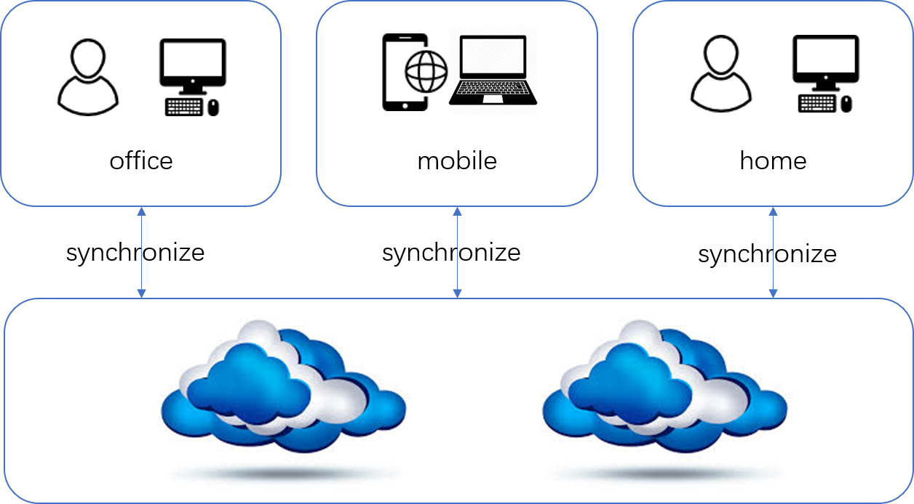

# CloudSync

这是一个帮助用户在本地存储与云对象存储之间同步文件的工具。

该项目实现了双向文件同步，即它既可以将本地文件同步到对象存储，也可以将对象存储的文件同步到本地。目前支持阿里云和腾讯云的对象存储服务，但它可拓展至任意的对象存储服务。该项目使用 Python 3 进行开发。

以下是本项目的系统框架示意图：



## 安装

在安装之前，首先要确保正确安装了 Python 3 和 pip 。然后运行以下命令：

```bash
git clone https://github.com/excalibur44/CloudSync.git
cd Cloudsync/cloudsync/
pip install -r requirements.txt
```

## 使用

在第一次使用的时候，需要将 cos_config.example.py 重命名为 cos_config.py，并修改里面的内容。如果是使用 OSS 作为云端的对象存储，则修改 ali 部分的数据；如果是使用 COS 作为云端的对象存储，则修改 tencent 部分的数据。以及要修改同步双方的目录，本地目录和云端目录。

修改完成后，运行 `python3 cloudsync.py -s <ali|tencent>` 即可开始同步。
